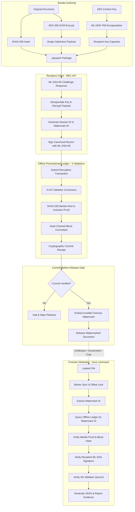

# System Architecture Specification

**Project**: Cryptographic Attribution and Immutable Decryption Provenance for Multi-Recipient Encrypted Document Distribution  
**Problem Statement**: SIH PS 26237  

---

## 1. High-Level Architecture Overview

The system provides an immutable, cryptographically verifiable provenance chain linking decrypted documents to individual recipient sessions using NIST-standardized Post-Quantum Cryptography (PQC), transform-domain invisible watermarking, and an offline permissioned Distributed Ledger Technology (DLT).



---

## 2. Core Cryptographic Protocols

### 2.1 Multi-Recipient Encryption
- Symmetric Cipher: **AES-256-GCM** (NIST SP 800-38D) with random 96-bit nonce.
- Document Hash: **SHA3-256** (NIST FIPS 202).
- Key Encapsulation: **ML-KEM-768** (NIST FIPS 203) yielding 32-byte uniform shared secret.
- Content key wrapped per recipient using AES-256-GCM keyed by the KEM shared secret.
- Document ciphertext generated exactly once, regardless of the number of recipients.

### 2.2 Recipient Authentication
- Zero passwords or symmetric shared credentials.
- Server generates random challenge:
  ```json
  {"challenge_id": "...", "recipient_id": "REC-047", "timestamp": 1727632000, "nonce": "..."}
  ```
- Recipient signs canonical JSON challenge with **ML-DSA-65** private key.
- Verified against registered public key in offline keystore registry.

### 2.3 Commit-Before-Release Workflow
1. Client initializes session: `session_id`, `watermark_id`, `timestamp`, `nonce`.
2. Assembles canonical record (omitting recipient identity from the watermark itself).
3. Signs record using recipient ML-DSA-65 key.
4. Broadcasts to 5 validator nodes (`VAL-01` to `VAL-05`).
5. Validators evaluate block chaining, Merkle root, and transaction validity.
6. 4-of-5 validators sign the proposed block header with their ML-DSA-65 keys.
7. Commitment receipt issued.
8. Watermark embedded and document released.
9. **Security Invariant**: If commit fails (e.g., fewer than 4 validator signatures), the release is aborted and plaintext is securely purged.

### 2.4 Forensic Watermarking & Barker Synchronization
- Color Domain: Luminance ($Y$ channel of YCrCb space).
- Transform: 2D Block-DCT ($8 \times 8$ blocks).
- Modulation: Mid-frequency differential modulation between $(u_1, v_1) = (2, 3)$ and $(u_2, v_2) = (3, 2)$ with $\Delta = 38.0$.
- Tiling: $16 \times 16$ blocks per tile ($128 \times 128$ pixels), repeated across the canvas.
- Synchronization: 16-bit Barker preamble (`1111100110101100`) for automatic sub-pixel and block phase recovery under arbitrary crops and shifts.
- ECC: Rate-3 majority-voting repetition coding with CRC-16 integrity verification.
